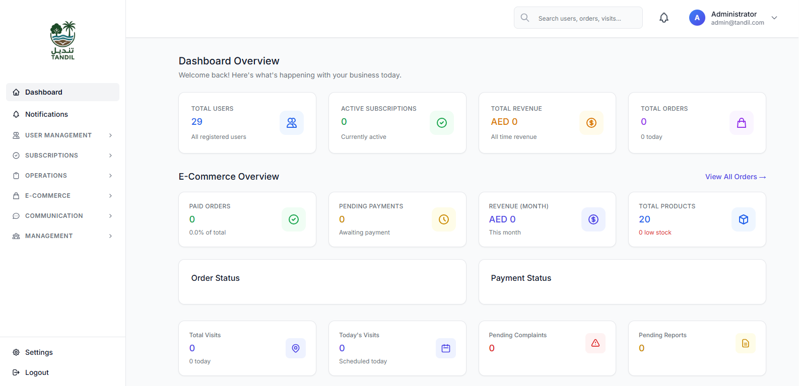
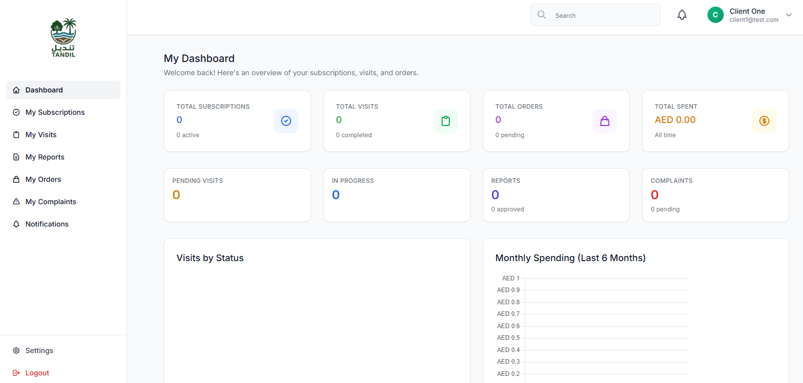
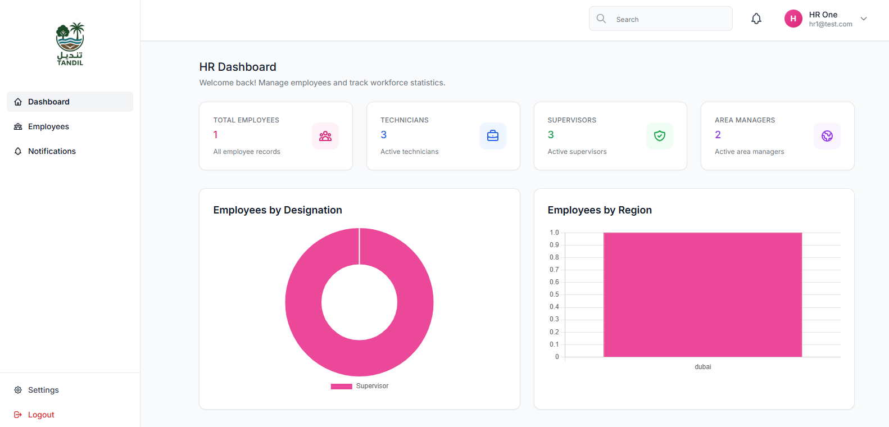
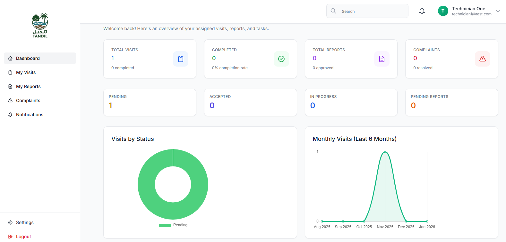
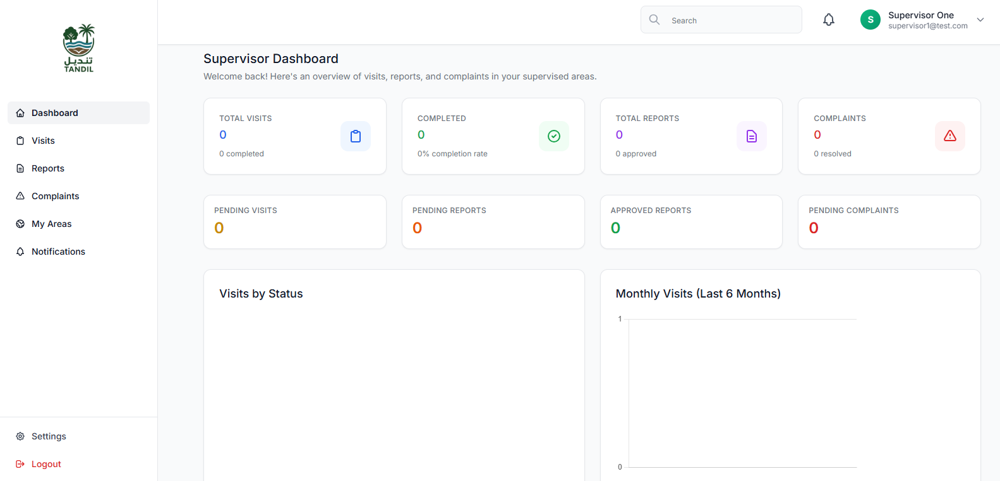
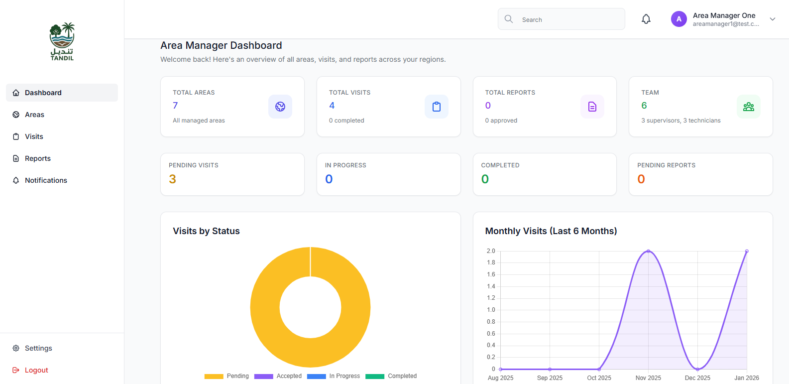

# 🌿 Tandil Backend (Laravel API)

<div align="center">


**Agriculture Service Management Platform**

[](https://laravel.com)
[](https://php.net)
[](LICENSE)

</div>

---

Tandil is a comprehensive agriculture service management platform designed for home & farm maintenance.  
This backend provides a complete role-based operational system to manage subscriptions, visits, technicians, supervisors, complaints, products, and more.

---

## 📸 Dashboard Screenshots

### Admin Dashboard
<div align="center">



*Admin Dashboard - Full system overview and management*

</div>

### Client Dashboard
<div align="center">



*Client Dashboard - Subscription management and service tracking*

</div>

### HR Dashboard
<div align="center">



*HR Dashboard - Employee management and workforce statistics*

</div>

### Technician Dashboard
<div align="center">



*Technician Dashboard - Visit management and service reports*

</div>

### Supervisor Dashboard
<div align="center">



*Supervisor Dashboard - Team oversight and visit approvals*

</div>

### Area Manager Dashboard
<div align="center">



*Area Manager Dashboard - Regional operations and coordination*

</div>

> **Note:** To add dashboard screenshots, save them in the `docs/screenshots/` directory with the naming convention shown above.

---

## 🚀 Features Implemented

### 🔐 1. Role-Based Access Control  
The system includes 6 user roles with dedicated permissions:

| Role | Description | Key Features |
|------|-------------|--------------|
| **Client** | Regular customers | Purchase subscriptions, place orders, manage service visits |
| **Technician** | Field service technicians | Perform on-site visits, complete service reports, upload photos |
| **Supervisor** | Team supervisors | Oversee technicians, manage visit schedules, approve reports |
| **Area Manager** | Regional managers | Manage multiple areas, coordinate supervisors, oversee operations |
| **HR** | Human resources | Manage employee records, handle HR tasks, maintain staff info |
| **Admin** | System administrators | Full access to manage users, roles, products, orders, settings |

Each module enforces role-based authorization using [Spatie Permissions](https://spatie.be/docs/laravel-permission).

---

## 📦 2. Subscription Management  
- ✅ Create and manage subscription plans  
- ✅ Auto-generate visits based on subscription schedule  
- ✅ Client subscription history & details  
- ✅ Visit calendar for operations panel  
- ✅ Payment tracking and status management

---

## 🛠️ 3. Visit Management Flow  
A complete end-to-end workflow:

```
1. Visit Creation
   ├── Auto-created from subscriptions
   └── Manually created by Admin/Supervisor

2. Technician Assignment
   └── Supervisor/Area Manager assigns a technician

3. Technician Visit Updates
   ├── Start visit
   ├── Upload before & after photos
   └── Add notes, status updates

4. Supervisor Approval
   ├── Approve or reject technician's report
   └── Send back for correction

5. Area Manager Oversight
   └── Monitor and intervene on escalated visits
```

---

## 📢 4. Complaint Management (With Escalation Logic)  
- ✅ Client or Technician can raise a complaint  
- ✅ Supervisor reviews & updates status  
- ✅ Auto-escalation to Area Manager for unresolved issues  
- ✅ Full CRUD with validation  
- ✅ Status tracking and notifications

---

## 🛒 5. Shop / Products Module  
- ✅ Product & Category CRUD with images
- ✅ Price, quantity, and purchase logic  
- ✅ Shopping cart functionality
- ✅ Order management with payment tracking
- ✅ API-ready for React Native shop module  
- ✅ Public API endpoints for products and categories

---

## 👥 6. HR Employee Management
- ✅ Complete employee CRUD operations
- ✅ Employee records with name, email, phone, designation
- ✅ Region-based employee management
- ✅ JSON API responses
- ✅ User account creation from employee records

---

## 🔔 7. Notifications System  
Event-based notifications for:
- 🔔 New visits  
- 🔔 Status updates  
- 🔔 Complaint escalations  
- 🔔 Technician assignments  
- 🔔 Report approvals
- 🔔 Payment confirmations

---

## 📁 Project Structure

```
tandil-backend/
├── app/
│   ├── Console/Commands/        # Artisan commands (admin management)
│   ├── Http/Controllers/       # API & Web controllers
│   │   ├── Admin/              # Admin dashboard & management
│   │   ├── HR/                 # HR employee management
│   │   ├── Shop/               # E-commerce controllers
│   │   ├── Technician/         # Technician workflows
│   │   ├── Supervisor/         # Supervisor workflows
│   │   └── Client/             # Client dashboard
│   ├── Models/                  # Eloquent models
│   ├── Services/               # Business logic services
│   ├── Notifications/          # Event notifications
│   └── Jobs/                   # Queue jobs
│
├── database/
│   ├── migrations/              # Database migrations
│   └── seeders/                # Database seeders
│
├── routes/
│   ├── api.php                  # API routes (96 endpoints)
│   └── web.php                  # Web routes
│
├── postman/
│   └── tandil_backend.json      # Complete Postman collection
│
└── docs/
    └── screenshots/             # Dashboard screenshots
```

---

## 🔧 Installation & Setup

### Prerequisites
- ✅ PHP 8.2+
- ✅ Composer
- ✅ Node.js & NPM
- ✅ MySQL/SQLite
- ✅ Git

### 1. Clone the repository
```bash
git clone https://github.com/chunilalavology-debug/tandil-backend.git
cd tandil-backend
```

### 2. Install dependencies
```bash
composer install
npm install
```

### 3. Environment Setup
```bash
cp .env.example .env
php artisan key:generate
```

### 4. Configure Database
Edit `.env` file and set your database credentials:
```env
DB_CONNECTION=mysql
DB_HOST=127.0.0.1
DB_PORT=3306
DB_DATABASE=tandil
DB_USERNAME=root
DB_PASSWORD=
```

### 5. Run Migrations & Seeders
```bash
php artisan migrate --seed
```

This will:
- ✅ Create all database tables
- ✅ Seed roles and permissions
- ✅ Create admin user (see credentials below)
- ✅ Seed sample data (products, categories, etc.)

### 6. Create Storage Link
```bash
php artisan storage:link
```

### 7. Start Development Server

**Windows:**
```bash
composer run dev:win
```

**Linux/Mac:**
```bash
composer run dev
```

Or manually:
```bash
php artisan serve
npm run dev
```

**Base URL:** `http://localhost:8000`  
**API Base URL:** `http://localhost:8000/api`

---

## 🔑 Default Credentials

After running seeders, you can login with:

### Admin
- **Email:** `admin@tandil.com`
- **Password:** `password123`
- **Dashboard:** `http://localhost:8000/admin/dashboard`

### Client
- **Email:** `client@tandil.com`
- **Password:** `password123`
- **Dashboard:** `http://localhost:8000/client/dashboard`

### HR
- **Email:** `hr@tandil.com`
- **Password:** `password123`
- **Dashboard:** `http://localhost:8000/hr/dashboard`

### Technician
- **Email:** `technician@tandil.com`
- **Password:** `password123`
- **Dashboard:** `http://localhost:8000/technician/dashboard`

### Supervisor
- **Email:** `supervisor@tandil.com`
- **Password:** `password123`
- **Dashboard:** `http://localhost:8000/supervisor/dashboard`

### Area Manager
- **Email:** `areamanager@tandil.com`
- **Password:** `password123`
- **Dashboard:** `http://localhost:8000/areamanager/dashboard`

To reset or ensure admin user exists:
```bash
php artisan admin:ensure
```

---

## 📡 API Endpoints

### 🔐 Authentication
- `POST /api/auth/register` - Register new user
- `POST /api/auth/login` - Login
- `POST /api/auth/logout` - Logout (protected)
- `GET /api/auth/profile` - Get user profile (protected)

### 🛒 Shop & Products (Public)
- `GET /api/shop/products` - List all products
- `GET /api/shop/products/{id}` - Get product details
- `GET /api/shop/categories` - List all categories
- `GET /api/shop/categories/{id}` - Get category with products

### 🛒 Shop & Orders (Protected)
- `POST /api/shop/cart/add` - Add to cart
- `GET /api/shop/cart` - View cart
- `DELETE /api/shop/cart/{id}` - Remove from cart
- `POST /api/shop/checkout` - Create order
- `GET /api/shop/orders` - List orders
- `GET /api/shop/orders/{id}` - Get order details
- `GET /api/shop/payments` - List payments/transactions

### 👥 HR Management (Admin Only)
- `GET /api/admin/hr/employees` - List employees
- `POST /api/admin/hr/employees` - Create employee
- `GET /api/admin/hr/employees/{id}` - Get employee
- `PUT /api/admin/hr/employees/{id}` - Update employee
- `DELETE /api/admin/hr/employees/{id}` - Delete employee

### 👤 Admin Management
- `GET /api/admin/users` - List users
- `POST /api/admin/users` - Create user
- `GET /api/admin/roles` - List roles

### 📋 Subscriptions
- `GET /api/subscriptions/plans` - Get subscription plans (public)
- `GET /api/subscriptions` - List user subscriptions (protected)
- `POST /api/subscriptions` - Create subscription (protected)

### 🛠️ Visits
- `GET /api/visits` - List visits (protected)
- `POST /api/visits` - Create visit (protected)
- `GET /api/visits/{id}` - Get visit details (protected)

### And many more...

**Total: 96 API endpoints**

---

## 📦 Postman Collection

Import the complete Postman collection from:
```
postman/tandil_backend.json
```

The collection includes:
1. ✅ Authentication endpoints
2. ✅ User & Role management
3. ✅ Subscription management
4. ✅ Visit management
5. ✅ Supervisor workflows
6. ✅ Technician workflows
7. ✅ Area Manager endpoints
8. ✅ HR Employee management
9. ✅ Shop & E-commerce APIs
10. ✅ Complaints management

---

## 🧪 Testing

Run the test suite:
```bash
php artisan test
```

Or using composer:
```bash
composer test
```

---

## 🛠️ Artisan Commands

### Admin Management
```bash
# Ensure admin user exists with correct credentials
php artisan admin:ensure

# Reset admin password
php artisan admin:reset admin@tandil.com --password=newpassword
```

### Database
```bash
# Fresh migration with seeders
php artisan migrate:fresh --seed

# Seed specific seeder
php artisan db:seed --class=CustomUsersSeeder
```

### Cache Management
```bash
# Clear all caches
php artisan optimize:clear

# Cache configuration
php artisan config:cache
php artisan route:cache
php artisan view:cache
```

---

## 🏗️ Tech Stack

| Technology | Version | Purpose |
|------------|---------|---------|
| **Laravel** | 12.x | PHP Framework |
| **PHP** | 8.2+ | Backend Language |
| **MySQL/SQLite** | Latest | Database |
| **Laravel Sanctum** | Latest | API Authentication |
| **Spatie Permission** | Latest | Role & Permission Management |
| **Tailwind CSS** | Latest | Frontend Styling |
| **Vite** | Latest | Asset Bundling |

---

## 📝 Environment Variables

Key environment variables in `.env`:

```env
APP_NAME=Tandil
APP_ENV=local
APP_DEBUG=true
APP_URL=http://localhost:8000

DB_CONNECTION=mysql
DB_HOST=127.0.0.1
DB_PORT=3306
DB_DATABASE=tandil
DB_USERNAME=root
DB_PASSWORD=

# Admin Credentials (optional, defaults to admin@tandil.com / password123)
APP_ADMIN_EMAIL=admin@tandil.com
APP_ADMIN_PASSWORD=password123
```

---

## 🚀 Production Deployment

### Pre-Deployment Checklist

- [ ] Set `APP_ENV=production` in `.env`
- [ ] Set `APP_DEBUG=false` in `.env`
- [ ] Run `php artisan config:cache`
- [ ] Run `php artisan route:cache`
- [ ] Run `php artisan view:cache`
- [ ] Ensure storage link exists: `php artisan storage:link`
- [ ] Run migrations: `php artisan migrate --force`
- [ ] Ensure admin user: `php artisan admin:ensure`

### Production Commands
```bash
# Optimize for production
php artisan optimize

# Clear and cache
php artisan optimize:clear
php artisan optimize
```

---

## 📚 Documentation

Additional documentation:
- `docs/queues.md` - Queue and worker setup guide
- `docs/screenshots/` - Dashboard screenshots directory

---

## 🤝 Contributing

Pull requests are welcome. For major changes, please open an issue first to discuss what you would like to change.

1. Fork the repository
2. Create your feature branch (`git checkout -b feature/AmazingFeature`)
3. Commit your changes (`git commit -m 'Add some AmazingFeature'`)
4. Push to the branch (`git push origin feature/AmazingFeature`)
5. Open a Pull Request

---

## 📄 License

This project is licensed under the MIT License.

---

## 👥 Authors

- **Tandil Development Team**

---

## 🙏 Acknowledgments

- [Laravel Framework](https://laravel.com)
- [Spatie Laravel Permission](https://spatie.be/docs/laravel-permission)
- All contributors

---

## 📞 Support

For support, email support@tandil.com or open an issue in the repository.

---

<div align="center">

**Built with ❤️ for Agriculture Service Management**

[⬆ Back to Top](#-tandil-backend-laravel-api)

</div>
